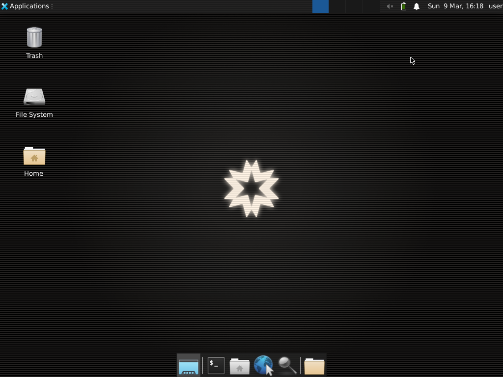

# NanoVM Desktop Sandbox - Open Source Virtual Computer for Computer Use

NanoVM Desktop Sandbox is a secure virtual desktop ready for Computer Use. Powered by [NanoVM](https://nanovm.dev).

Each sandbox is isolated from the others and can be customized with any dependencies you want.



## Examples

**SDK Examples**

- Basic Examples:
  - [Python](./examples/basic-python)
  - [JavaScript](./examples/basic-javascript)
- Streaming Desktop Applications:
  - [Python](./examples/streaming-apps-python)
  - [JavaScript](./examples/streaming-apps-javascript)

**[Open Computer Use](https://github.com/e2b-dev/open-computer-use)**

- Computer use made with 100% open source LLMs.

**[🏄 Surf](https://github.com/e2b-dev/surf)**

- OpenAI Computer Use Agent using NanoVM's Desktop Sandbox. Runs as a Next.js app.

## 🚀 Getting started

The NanoVM Desktop Sandbox is built on top of [NanoVM Sandbox](https://e2b.dev/docs).

### 1. Get NanoVM API key

Sign up at [NanoVM](https://e2b.dev) and get your API key.
Set environment variable `NVM_API_KEY` with your API key.

### 2. Install SDK

**Python**

```bash
pip install nanovm-desktop
```

**JavaScript**

```bash
npm install @nanovm/desktop
```

### 3. Create Desktop Sandbox

**Python**

```python
from nvm_desktop import Sandbox

# Create a new desktop sandbox
desktop = Sandbox.create()

# Launch an application
desktop.launch('google-chrome')  # or vscode, firefox, etc.

# Wait 10s for the application to open
desktop.wait(10000)

# Stream the application's window
# Note: There can be only one stream at a time
# You need to stop the current stream before streaming another application
desktop.stream.start(
    window_id=desktop.get_current_window_id(), # if not provided the whole desktop will be streamed
    require_auth=True
)

# Get the stream auth key
auth_key = desktop.stream.get_auth_key()

# Print the stream URL
print('Stream URL:', desktop.stream.get_url(auth_key=auth_key))

# Kill the sandbox after the tasks are finished
# desktop.kill()
```

**JavaScript**

```javascript
import { Sandbox } from '@nanovm/desktop'

// Start a new desktop sandbox
const desktop = await Sandbox.create()

// Launch an application
await desktop.launch('google-chrome') // or vscode, firefox, etc.

// Wait 10s for the application to open
await desktop.wait(10000)

// Stream the application's window
// Note: There can be only one stream at a time
// You need to stop the current stream before streaming another application
await desktop.stream.start({
  windowId: await desktop.getCurrentWindowId(), // if not provided the whole desktop will be streamed
  requireAuth: true,
})

// Get the stream auth key
const authKey = desktop.stream.getAuthKey()

// Print the stream URL
console.log('Stream URL:', desktop.stream.getUrl({ authKey }))

// Kill the sandbox after the tasks are finished
// await desktop.kill()
```

## Features

### Streaming desktop's screen

**Python**

```python
from nvm_desktop import Sandbox
desktop = Sandbox.create()

# Start the stream
desktop.stream.start()

# Get stream URL
url = desktop.stream.get_url()
print(url)

# Get stream URL and disable user interaction
url = desktop.stream.get_url(view_only=True)
print(url)

# Stop the stream
desktop.stream.stop()
```

**JavaScript**

```javascript
import { Sandbox } from '@nanovm/desktop'

const desktop = await Sandbox.create()

// Start the stream
await desktop.stream.start()

// Get stream URL
const url = desktop.stream.getUrl()
console.log(url)

// Get stream URL and disable user interaction
const url = desktop.stream.getUrl({ viewOnly: true })
console.log(url)

// Stop the stream
await desktop.stream.stop()
```

### Streaming with password protection

**Python**

```python
from nvm_desktop import Sandbox
desktop = Sandbox.create()

# Start the stream
desktop.stream.start(
    require_auth=True  # Require authentication with an auto-generated key
)

# Retrieve the authentication key
auth_key = desktop.stream.get_auth_key()

# Get stream URL
url = desktop.stream.get_url(auth_key=auth_key)
print(url)

# Stop the stream
desktop.stream.stop()
```

**JavaScript**

```javascript
import { Sandbox } from '@nanovm/desktop'

const desktop = await Sandbox.create()

// Start the stream
await desktop.stream.start({
  requireAuth: true, // Require authentication with an auto-generated key
})

// Retrieve the authentication key
const authKey = await desktop.stream.getAuthKey()

// Get stream URL
const url = desktop.stream.getUrl({ authKey })
console.log(url)

// Stop the stream
await desktop.stream.stop()
```

### Streaming specific application

> [!WARNING]
>
> - Will raise an error if the desired application is not open yet
> - The stream will close once the application closes
> - Creating multiple streams at the same time is not supported, you may have to stop the current stream and start a new one for each application

**Python**

```python
from nvm_desktop import Sandbox
desktop = Sandbox.create()

# Get current (active) window ID
window_id = desktop.get_current_window_id()

# Get all windows of the application
window_ids = desktop.get_application_windows("Firefox")

# Start the stream
desktop.stream.start(window_id=window_ids[0])

# Stop the stream
desktop.stream.stop()
```

**JavaScript**

```javascript
import { Sandbox } from '@nanovm/desktop'

const desktop = await Sandbox.create()

// Get current (active) window ID
const windowId = await desktop.getCurrentWindowId()

// Get all windows of the application
const windowIds = await desktop.getApplicationWindows('Firefox')

// Start the stream
await desktop.stream.start({ windowId: windowIds[0] })

// Stop the stream
await desktop.stream.stop()
```

### Mouse control

**Python**

```python
from nvm_desktop import Sandbox
desktop = Sandbox.create()

desktop.double_click()
desktop.left_click()
desktop.left_click(x=100, y=200)
desktop.right_click()
desktop.right_click(x=100, y=200)
desktop.middle_click()
desktop.middle_click(x=100, y=200)
desktop.scroll(10) # Scroll by the amount. Positive for up, negative for down.
desktop.move_mouse(100, 200) # Move to x, y coordinates
desktop.drag((100, 100), (200, 200)) # Drag using the mouse
desktop.mouse_press("left") # Press the mouse button
desktop.mouse_release("left") # Release the mouse button
```

**JavaScript**

```javascript
import { Sandbox } from '@nanovm/desktop'

const desktop = await Sandbox.create()

await desktop.doubleClick()
await desktop.leftClick()
await desktop.leftClick(100, 200)
await desktop.rightClick()
await desktop.rightClick(100, 200)
await desktop.middleClick()
await desktop.middleClick(100, 200)
await desktop.scroll(10) // Scroll by the amount. Positive for up, negative for down.
await desktop.moveMouse(100, 200) // Move to x, y coordinates
await desktop.drag([100, 100], [200, 200]) // Drag using the mouse
await desktop.mousePress('left') // Press the mouse button
await desktop.mouseRelease('left') // Release the mouse button
```

### Keyboard control

**Python**

```python
from nvm_desktop import Sandbox
desktop = Sandbox.create()

# Write text at the current cursor position with customizable typing speed
desktop.write("Hello, world!")  # Default: chunk_size=25, delay_in_ms=75
desktop.write("Fast typing!", chunk_size=50, delay_in_ms=25)  # Faster typing

# Press keys
desktop.press("enter")
desktop.press("space")
desktop.press("backspace")
desktop.press(["ctrl", "c"]) # Key combination
```

**JavaScript**

```javascript
import { Sandbox } from '@nanovm/desktop'

const desktop = await Sandbox.create()

// Write text at the current cursor position with customizable typing speed
await desktop.write('Hello, world!')
await desktop.write('Fast typing!', { chunkSize: 50, delayInMs: 25 }) // Faster typing

// Press keys
await desktop.press('enter')
await desktop.press('space')
await desktop.press('backspace')
await desktop.press(['ctrl', 'c']) // Key combination
```

### Window control

**Python**

```python
from nvm_desktop import Sandbox
desktop = Sandbox.create()

# Get current (active) window ID
window_id = desktop.get_current_window_id()

# Get all windows of the application
window_ids = desktop.get_application_windows("Firefox")

# Get window title
title = desktop.get_window_title(window_id)
```

**JavaScript**

```javascript
import { Sandbox } from '@nanovm/desktop'

const desktop = await Sandbox.create()

// Get current (active) window ID
const windowId = await desktop.getCurrentWindowId()

// Get all windows of the application
const windowIds = await desktop.getApplicationWindows('Firefox')

// Get window title
const title = await desktop.getWindowTitle(windowId)
```

### Screenshot

**Python**

```python
from nvm_desktop import Sandbox
desktop = Sandbox.create()

# Take a screenshot and save it as "screenshot.png" locally
image = desktop.screenshot()
# Save the image to a file
with open("screenshot.png", "wb") as f:
    f.write(image)
```

**JavaScript**

```javascript
import { Sandbox } from '@nanovm/desktop'

const desktop = await Sandbox.create()
const image = await desktop.screenshot()
// Save the image to a file
fs.writeFileSync('screenshot.png', image)
```

### Open file

**Python**

```python
from nvm_desktop import Sandbox
desktop = Sandbox.create()

# Open file with default application
desktop.files.write("/home/user/index.js", "console.log('hello')") # First create the file
desktop.open("/home/user/index.js") # Then open it
```

**JavaScript**

```javascript
import { Sandbox } from '@nanovm/desktop'

const desktop = await Sandbox.create()

// Open file with default application
await desktop.files.write('/home/user/index.js', "console.log('hello')") // First create the file
await desktop.open('/home/user/index.js') // Then open it
```

### Launch applications

**Python**

```python
from nvm_desktop import Sandbox
desktop = Sandbox.create()

# Launch the application
desktop.launch('google-chrome')
```

**JavaScript**

```javascript
import { Sandbox } from '@nanovm/desktop'

const desktop = await Sandbox.create()

// Launch the application
await desktop.launch('google-chrome')
```

### Run any bash commands

**Python**

```python
from nvm_desktop import Sandbox
desktop = Sandbox.create()

# Run any bash command
out = desktop.commands.run("ls -la /home/user")
print(out)
```

**JavaScript**

```javascript
import { Sandbox } from '@nanovm/desktop'

const desktop = await Sandbox.create()

// Run any bash command
const out = await desktop.commands.run('ls -la /home/user')
console.log(out)
```

### Wait

**Python**

```python
from nvm_desktop import Sandbox
desktop = Sandbox.create()

desktop.wait(1000) # Wait for 1 second
```

**JavaScript**

```javascript
import { Sandbox } from '@nanovm/desktop'

const desktop = await Sandbox.create()
await desktop.wait(1000) // Wait for 1 second
```

## Under the hood

The desktop-like environment is based on Linux and [Xfce](https://www.xfce.org/) at the moment. We chose Xfce because it's a fast and lightweight environment that's also popular and actively supported. However, this Sandbox template is fully customizable and you can create your own desktop environment.
Check out the sandbox template's code [here](./template/).
