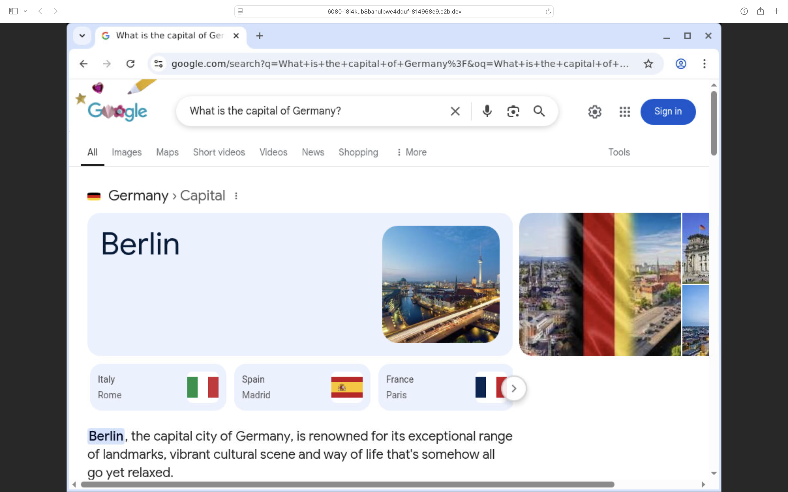
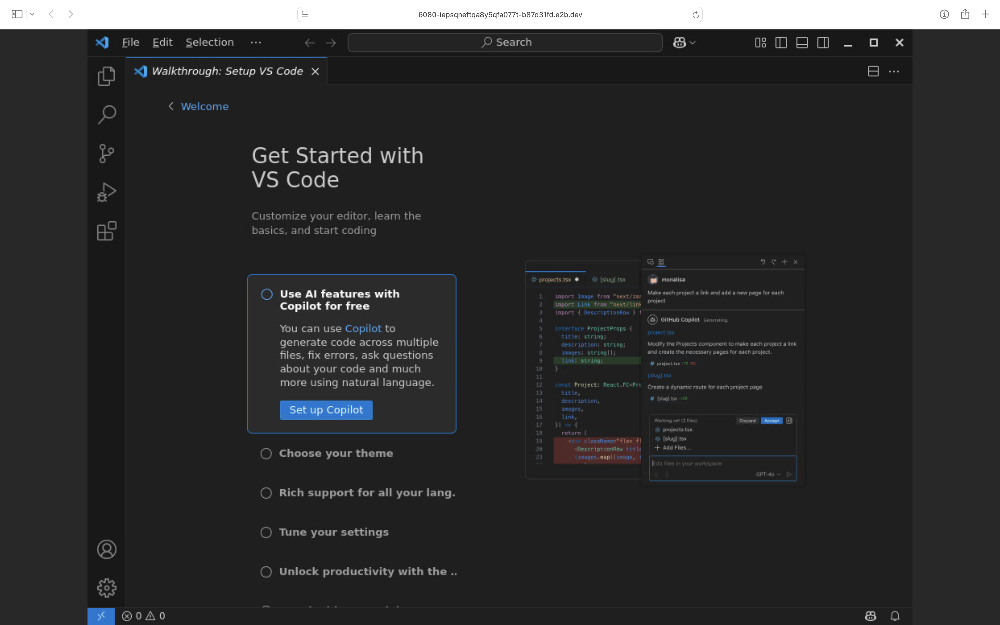

# Streaming Applications Example

Streaming applications is a feature of the E2B Desktop Sandbox.

| Streaming Chrome Window                                 | Streaming VS Code Window                                 |
| ------------------------------------------------------- | -------------------------------------------------------- |
|  |  |

> [!WARNING]
>
> - Will raise an error if the desired application is not open yet
> - The stream will close once the application closes
> - Creating multiple streams at the same time is not supported, you may have to stop the current stream and start a new one for each application

## How to run

### 1. Get NanoVM API key

Sign up at [NanoVM](https://e2b.dev) and get your API key.
Set environment variable `NANOVM_API_KEY` with your API key.

### 2. Install SDK

```bash
npm install @nanovm/desktop
```

### 3. Create Desktop Sandbox

```javascript
import { Sandbox } from '@nanovm/desktop'

// Start a new desktop sandbox
const desktop = await Sandbox.create()
console.log('Desktop sandbox created', desktop.sandboxId)

// Launch an application
console.log('Launching Google Chrome')
await desktop.launch('google-chrome') // or vscode, firefox, etc.

// Wait 15s for the application to open
await desktop.wait(15000)

// Stream the application's window
// Note: there can be only one stream at a time
// You need to stop the current stream before streaming another application
console.log('Starting to stream Google Chrome')
await desktop.stream.start({
  windowId: await desktop.getCurrentWindowId(), // if not provided the whole desktop will be streamed
  requireAuth: true,
})

// Get the stream auth key
const authKey = desktop.stream.getAuthKey()

// Print the stream URL
console.log('Stream URL:', desktop.stream.getUrl({ authKey }))

// Do some actions in the application
console.log('Writing to Google Chrome')
await desktop.write('What is the capital of Germany?')

console.log('Pressing Enter')
await desktop.press('Enter')

// wait 15s for page to load
console.log('Waiting 15s')
await desktop.wait(15000)

// Stop the stream
console.log('Stopping the stream')
await desktop.stream.stop()

// Open another application
console.log('Launching VS Code')
await desktop.launch('code')

// Wait 15s for the application to open
await desktop.wait(15000)

// Start streaming the new application
console.log('Starting to stream VS Code')
await desktop.stream.start({
  windowId: await desktop.getCurrentWindowId(), // if not provided the whole desktop will be streamed
  requireAuth: true,
})

// Get the stream auth key
const authKey2 = desktop.stream.getAuthKey()

// Print the stream URL
console.log('Stream URL:', desktop.stream.getUrl({ authKey: authKey2 }))

// Kill the sandbox after the tasks are finished
// await desktop.kill()
```
