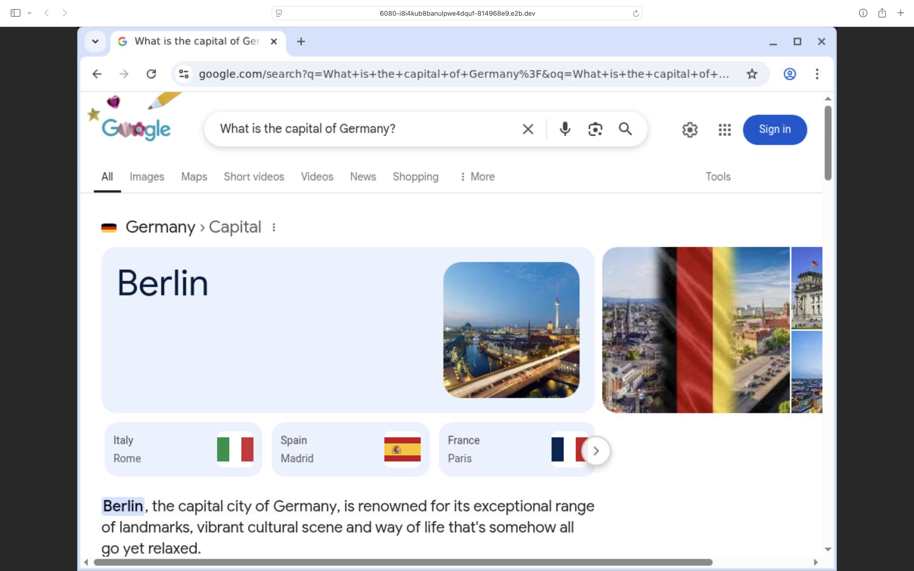
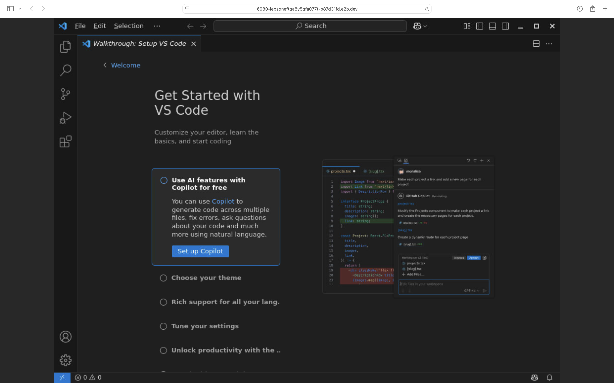

# Streaming Applications Example

Streaming applications is a feature of the NanoVM Desktop Sandbox.

| Streaming Chrome Window                                 | Streaming VS Code Window                                 |
| ------------------------------------------------------- | -------------------------------------------------------- |
|  |  |

> [!WARNING]
>
> - Will raise an error if the desired application is not open yet
> - The stream will close once the application closes
> - Creating multiple streams at the same time is not supported, you may have to stop the current stream and start a new one for each application

## How to run

### 1. Get NanoVM API key

Sign up at [NanoVM](https://e2b.dev) and get your API key.
Set environment variable `NANOVM_API_KEY` with your API key.

### 2. Install SDK

```bash
pip install nanovm-desktop
```

### 3. Create Desktop Sandbox

```python
from nanovm_desktop import Sandbox

# Create a new desktop sandbox
desktop = Sandbox.create()
print('Desktop sandbox created', desktop.sandbox_id)

# Launch an application
print('Launching Google Chrome')
desktop.launch('google-chrome')  # or vscode, firefox, etc.

# Wait 15s for the application to open
desktop.wait(15000)

# Stream the application's window
# Note: there can be only one stream at a time
# You need to stop the current stream before streaming another application
print('Starting to stream Google Chrome')
desktop.stream.start(
    window_id=desktop.get_current_window_id(),  # if not provided the whole desktop will be streamed
    require_auth=True,
)

# Get the stream auth key
auth_key = desktop.stream.get_auth_key()

# Print the stream URL
print('Stream URL:', desktop.stream.get_url(auth_key=auth_key))

# Do some actions in the application
print('Writing to Google Chrome')
desktop.write('What is the capital of Germany?')

print('Pressing Enter')
desktop.press('enter')

# wait 15s for page to load
print('Waiting 15s')
desktop.wait(15000)

# Stop the stream
print('Stopping the stream')
desktop.stream.stop()

# Open another application
print('Launching VS Code')
desktop.launch('code')

# Wait 15s for the application to open
desktop.wait(15000)

# Start streaming the new application
print('Starting to stream VS Code')
desktop.stream.start(
    window_id=desktop.get_current_window_id(),  # if not provided the whole desktop will be streamed
    require_auth=True,
)

# Get the stream auth key
auth_key2 = desktop.stream.get_auth_key()

# Print the stream URL
print('Stream URL:', desktop.stream.get_url(auth_key=auth_key2))

# Kill the sandbox after the tasks are finished
# desktop.kill()
```
